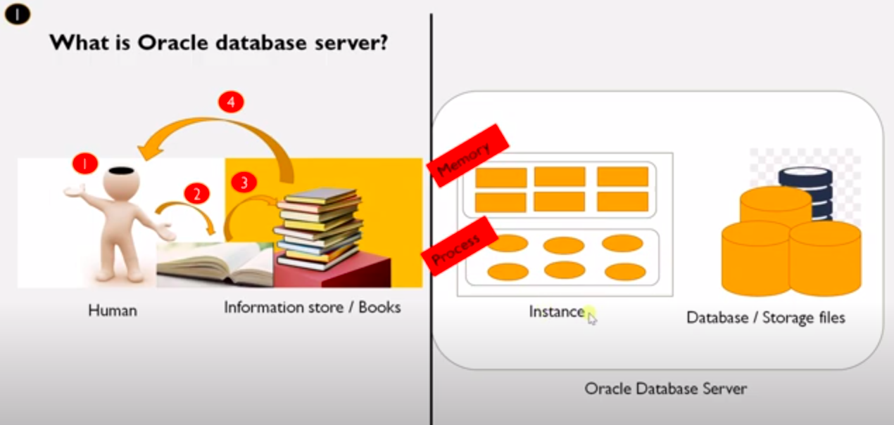
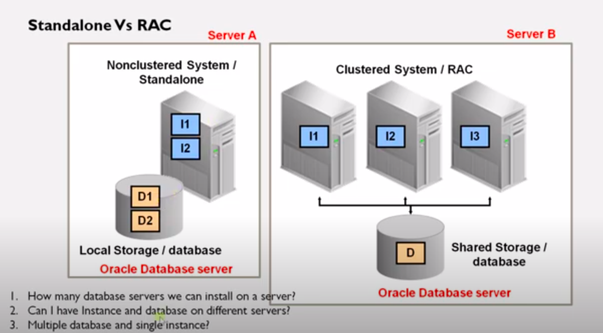

 

Normally We Read a topic, written was in the notebook for Revision. If We Forgot the topic in certain time again We go through from the notebook.

Likewise, In the system we enters the data, We stored in to the server called Database. If we wants in future We easily Retrieves from the server.

 