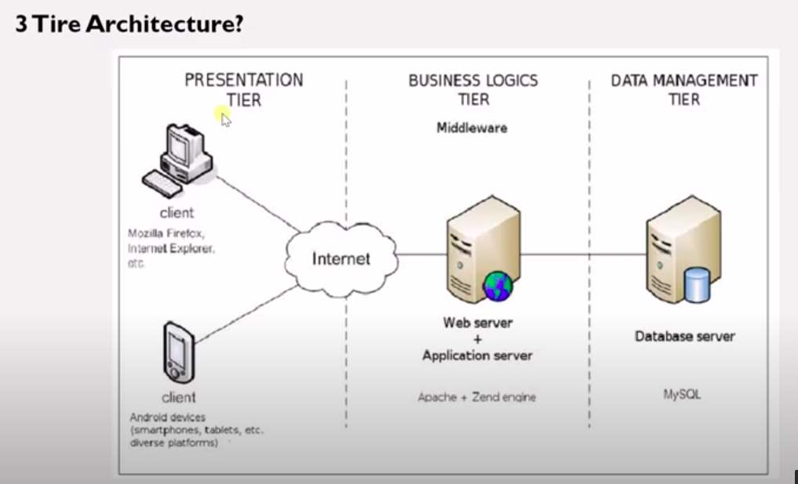

### Three tier Architecture with standalone vs RAC

Three tier Architecture is nothing but it is the three layer.which are, 
<ul>
<li>Presentation Tier</li>
<li>Business Logics Tier</li>
<li>Data Management Tier</li>
</ul>